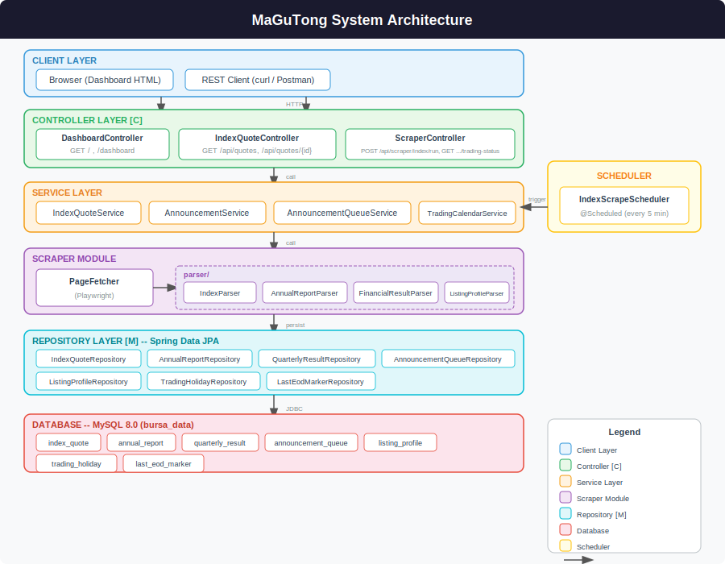
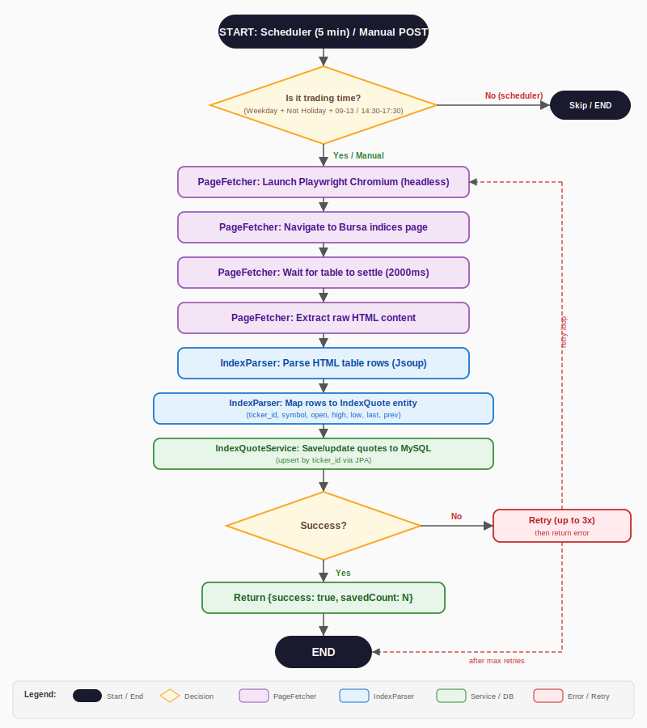
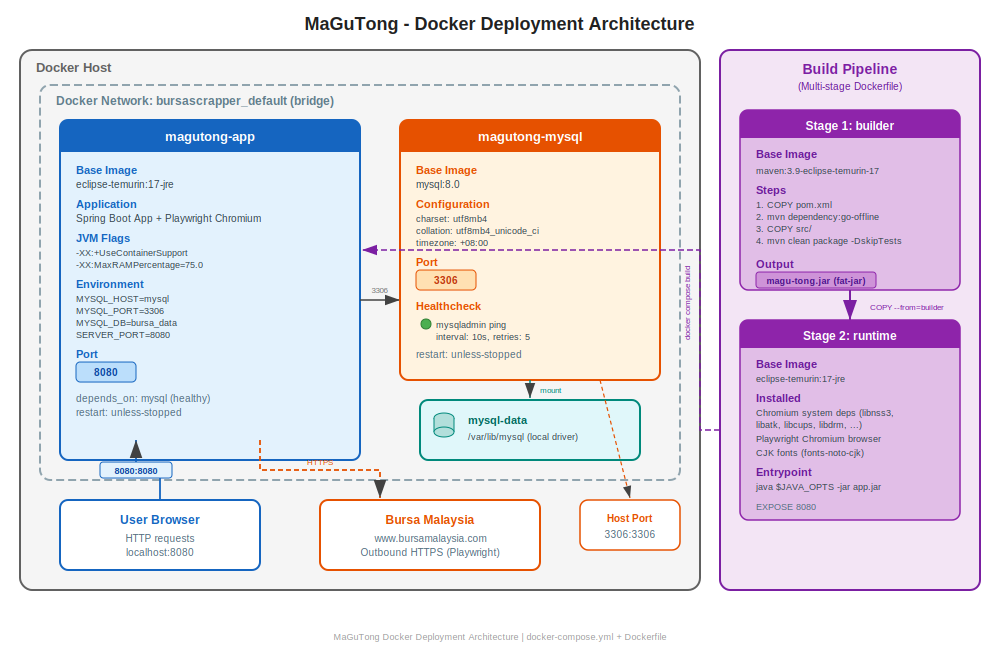

<div align="center">

# 马股通

**马来西亚股票数据抓取与解析服务**

[](https://adoptium.net/)
[](https://spring.io/projects/spring-boot)
[](https://www.mysql.com/)
[](https://playwright.dev/java/)
[](https://www.docker.com/)
[](./LICENSE)

<br/>

<sub>
<b>作者：</b> 钟智强
&nbsp;&middot;&nbsp;
<b>包名：</b> <code>xin.ctkqiang.mybursa</code>
&nbsp;&middot;&nbsp;
<b>许可证：</b> <a href="./LICENSE">MIT</a>
</sub>

</div>

---

<details>
<summary><b>目录 (Table of Contents)</b></summary>

- [项目简介](#一项目简介)
- [系统架构](#二系统架构)
- [技术栈](#三技术栈)
- [项目结构](#四项目结构)
- [数据库设计](#五数据库设计)
- [抓取工作流](#六抓取工作流)
- [快速开始](#七快速开始)
- [Docker 部署](#八docker-部署)
- [REST API 参考](#九rest-api-参考)
- [配置参考](#十配置参考)
- [调度机制](#十一调度机制)
- [许可证](#十二许可证)

</details>

---

## 一、项目简介

马股通是一个基于 **Java 17 + Spring Boot 3** 的后端服务，用于自动抓取马来西亚证券交易所
(Bursa Malaysia) 的公开市场数据：

| 数据类型           | 说明                        | 数据源                 |
| :----------------- | :-------------------------- | :--------------------- |
| **指数与股票行情** | 实时指数价格快照 (35+ 指数) | Bursa Malaysia Indices |
| **年度报告**       | 上市公司年度财务报告        | Bursa Announcements    |
| **季度财报**       | 季度收入、利润、EPS、DPS    | Bursa Announcements    |
| **上市概况**       | IPO/窝轮发行信息            | Bursa Announcements    |
| **财政年度变更**   | 公司财年调整公告            | Bursa Announcements    |

数据通过 **Playwright 无头浏览器**从 Bursa Malaysia 官网实时抓取，经 **Jsoup** 解析后
持久化至 **MySQL**，并通过 REST API 和 Thymeleaf 仪表盘对外提供服务。

> **架构选型：** 本项目采用经典 **MVC** 分层架构 —— Model (JPA 实体 + 仓储)、
> View (Thymeleaf 仪表盘)、Controller (REST + 页面控制器)。
> 视图层为只读的服务端渲染仪表盘，无需 MVVM 的双向绑定机制。

> **关于 ZenRows：** 本项目**不使用**任何第三方付费抓取代理，
> 完全依赖本地 Playwright 无头浏览器直连目标站点。

---

## 二、系统架构

<div align="center">

<br/>
<sub><i>图 1：马股通系统架构总览</i></sub>
</div>

<br/>

系统采用**分层架构**，各层职责清晰：

| 层级               | 组件                                                                 | 职责                                       |
| :----------------- | :------------------------------------------------------------------- | :----------------------------------------- |
| **Client**         | Browser / REST Client                                                | 用户通过仪表盘或 API 访问数据              |
| **Controller [C]** | `DashboardController`, `IndexQuoteController`, `ScraperController`   | 路由分发、请求校验、响应封装               |
| **Service**        | `IndexQuoteService`, `AnnouncementService`, `TradingCalendarService` | 核心业务逻辑编排                           |
| **Scraper**        | `PageFetcher` + `parser/*`                                           | 页面获取 (Playwright) 与 HTML 解析 (Jsoup) |
| **Repository [M]** | 7 个 Spring Data JPA 接口                                            | 数据持久化抽象                             |
| **Database**       | MySQL 8.0 (`bursa_data`)                                             | 7 张业务表，utf8mb4 字符集                 |
| **Scheduler**      | `IndexScrapeScheduler`                                               | 每 5 分钟触发，仅交易时段内执行            |

### 关键设计决策

1. **抓取与解析分离** — `PageFetcher` 负责页面获取，`parser/*` 负责 HTML 解析，职责单一
2. **公告队列驱动** — `announcement_queue` 表实现异步处理 (状态机：`0`→`1`/`-1`)
3. **交易时段集中判定** — `TradingCalendarService` 统一管理，支持假期表
4. **配置外部化** — `@ConfigurationProperties` 绑定，支持环境变量覆盖
5. **Playwright 生命周期** — 单例 Bean + `@PreDestroy` 确保浏览器资源释放

详细架构说明见 [`docs/ARCHITECTURE.md`](./docs/ARCHITECTURE.md)，
Python → Java 迁移对照见 [`docs/MIGRATION.md`](./docs/MIGRATION.md)。

---

## 三、技术栈

| 领域         | 技术方案                                       | 版本   | 用途                                |
| :----------- | :--------------------------------------------- | :----- | :---------------------------------- |
| 运行时       | Eclipse Temurin JDK                            | 17     | LTS Java 运行环境                   |
| 框架         | Spring Boot                                    | 3.3.4  | Web + JPA + Scheduling + Validation |
| 浏览器自动化 | Playwright for Java                            | 1.47.0 | 无头 Chromium 抓取动态渲染页面      |
| HTML 解析    | Jsoup                                          | 1.18.1 | DOM 解析与数据提取                  |
| ORM          | Spring Data JPA + Hibernate                    | 6.5.x  | 实体映射与仓储抽象                  |
| 数据库       | MySQL                                          | 8.0    | 关系型数据持久化                    |
| 视图引擎     | Thymeleaf                                      | 3.1.x  | 服务端渲染仪表盘                    |
| 日志         | SLF4J + Lombok `@Slf4j`                        | -      | 结构化日志输出                      |
| 配置         | `application.yml` + `@ConfigurationProperties` | -      | 类型安全的外部化配置                |
| 构建         | Apache Maven                                   | 3.9+   | 依赖管理与构建生命周期              |
| 容器化       | Docker + Docker Compose                        | -      | 多阶段构建 + 服务编排               |

---

## 四、项目结构

```
MaGuTong/
├── pom.xml                         # Maven 构建配置 (groupId: xin.ctkqiang)
├── Dockerfile                      # 多阶段 Docker 构建
├── docker-compose.yml              # Docker Compose 编排 (app + MySQL)
├── .dockerignore                   # Docker 构建排除规则
├── .githooks/                      # Git 钩子
│   └── pre-commit                  #   提交前语言规范检查
├── LICENSE                         # MIT 许可证
├── README.md                       # 本文件
├── docs/                           # 文档与图表
│   ├── ARCHITECTURE.md             #   架构设计说明
│   ├── MIGRATION.md                #   Python → Java 迁移对照
│   ├── architecture.svg            #   系统架构图
│   ├── scraping-workflow.svg       #   抓取工作流图
│   ├── database-schema.svg         #   数据库 ER 图
│   └── docker-deployment.svg       #   Docker 部署图
└── src/
    ├── main/
    │   ├── java/xin/ctkqiang/mybursa/
    │   │   ├── MaGuTongApplication.java    # @SpringBootApplication + @EnableScheduling
    │   │   ├── config/
    │   │   │   ├── PlaywrightConfig.java   # Playwright 单例 Bean + @PreDestroy
    │   │   │   └── ScraperProperties.java  # @ConfigurationProperties("magu-tong")
    │   │   ├── controller/
    │   │   │   ├── DashboardController.java    # GET /, /dashboard
    │   │   │   ├── IndexQuoteController.java   # GET /api/quotes, /api/quotes/{id}
    │   │   │   └── ScraperController.java      # POST /api/scraper/index/run
    │   │   ├── dto/
    │   │   │   └── AnnouncementInfo.java
    │   │   ├── model/                      # 7 个 JPA @Entity
    │   │   │   ├── AnnouncementQueue.java
    │   │   │   ├── AnnualReport.java
    │   │   │   ├── IndexQuote.java
    │   │   │   ├── LastEodMarker.java
    │   │   │   ├── ListingProfile.java
    │   │   │   ├── QuarterlyResult.java
    │   │   │   └── TradingHoliday.java
    │   │   ├── repository/                 # 7 个 JpaRepository 接口
    │   │   ├── scheduler/
    │   │   │   └── IndexScrapeScheduler.java   # @Scheduled(fixedDelay)
    │   │   ├── service/
    │   │   │   ├── IndexQuoteService.java
    │   │   │   ├── AnnouncementService.java
    │   │   │   ├── AnnouncementQueueService.java
    │   │   │   ├── AnnouncementType.java       # enum
    │   │   │   ├── TradingCalendarService.java
    │   │   │   └── scraper/
    │   │   │       ├── PageFetcher.java        # Playwright 页面获取
    │   │   │       └── parser/
    │   │   │           ├── IndexParser.java
    │   │   │           ├── AnnualReportParser.java
    │   │   │           ├── FinancialResultParser.java
    │   │   │           └── ListingProfileParser.java
    │   │   └── util/
    │   │       └── ParseUtils.java
    │   └── resources/
    │       ├── application.yml
    │       ├── schema.sql
    │       ├── templates/dashboard.html
    │       └── static/css/dashboard.css
    └── test/
        └── java/xin/ctkqiang/mybursa/
            └── util/ParseUtilsTest.java
```

---

## 五、数据库设计

<div align="center">

<br/>
<sub><i>图 2：bursa_data 数据库 ER 图</i></sub>
</div>

<br/>

数据库名：**`bursa_data`**，字符集 `utf8mb4`，排序规则 `utf8mb4_unicode_ci`。

### 核心数据表

| 表名                 | 主键                     | 唯一键                      | 字段数 | 说明                        |
| :------------------- | :----------------------- | :-------------------------- | :----- | :-------------------------- |
| `market_index_quote` | `ticker_id` (VARCHAR 32) | —                           | 11     | 实时指数/股票行情快照       |
| `annual_report`      | `id` (BIGINT AUTO)       | `(stock_code, ref_id)`      | 12     | 年度报告                    |
| `quarterly_result`   | `id` (BIGINT AUTO)       | `(stock_code, fin_qtr_end)` | 26     | 季度财报 (含当季/同比/累计) |
| `listing_profile`    | `id` (BIGINT AUTO)       | `(stock_code, ref_id)`      | 18     | 上市概况 (IPO/窝轮)         |

### 处理与调度表

| 表名                 | 主键                     | 唯一键  | 说明                                                        |
| :------------------- | :----------------------- | :------ | :---------------------------------------------------------- |
| `announcement_queue` | `queue_id` (BIGINT AUTO) | `(url)` | 待处理公告队列 (`process_state`: 0=待处理, 1=成功, -1=失败) |
| `last_eod_marker`    | `en_type` (VARCHAR 32)   | —       | 各公告类型最后处理时间标记                                  |
| `trading_holiday`    | `holiday_date` (DATE)    | —       | 交易假期日历                                                |

完整建表语句见 [`src/main/resources/schema.sql`](./src/main/resources/schema.sql)。

---

## 六、抓取工作流

<div align="center">

<br/>
<sub><i>图 3：指数行情抓取工作流</i></sub>
</div>

<br/>

### 工作流详解

```
触发方式
├── 自动：IndexScrapeScheduler 每 5 分钟触发
│   └── 先经过交易时段三重过滤（周末 → 假期 → 时段）
└── 手动：POST /api/scraper/index/run（不受时段限制）

抓取流程
├── 1. PageFetcher 启动 Playwright Chromium（无头模式）
├── 2. 导航至 Bursa Malaysia 指数页面
├── 3. 等待表格渲染稳定（2000ms）
├── 4. 提取原始 HTML 内容
├── 5. IndexParser 使用 Jsoup 解析表格行
├── 6. 映射为 IndexQuote 实体（ticker_id, symbol, OHLC prices）
├── 7. 通过 JPA saveAll() 批量 upsert 至 MySQL
└── 8. 返回 {success: true, savedCount: N}

异常处理
├── 导航超时：最多重试 3 次（可配置）
├── 解析失败：记录错误日志，跳过异常行
└── 数据库异常：事务回滚，返回错误响应
```

---

## 七、快速开始

### 1. 环境要求

| 依赖  | 最低版本 | 推荐               |
| :---- | :------- | :----------------- |
| JDK   | 17       | Eclipse Temurin 17 |
| Maven | 3.8      | 3.9+               |
| MySQL | 8.0      | 8.0 (Docker)       |

### 2. 准备数据库

#### 方式 A：Docker（推荐）

```bash
docker run -d \
  --name magutong-mysql \
  -p 3306:3306 \
  -e MYSQL_ALLOW_EMPTY_PASSWORD=yes \
  -e MYSQL_DATABASE=bursa_data \
  -e TZ=Asia/Kuala_Lumpur \
  -v magutong-mysql-data:/var/lib/mysql \
  mysql:8.0 \
  --character-set-server=utf8mb4 \
  --collation-server=utf8mb4_unicode_ci \
  --default-time-zone='+08:00'
```

<details>
<summary>容器管理命令</summary>

```bash
docker stop magutong-mysql              # 停止
docker start magutong-mysql             # 重新启动
docker rm -f magutong-mysql             # 删除容器 (数据保留在 volume)
docker volume rm magutong-mysql-data    # 彻底删除数据
```

</details>

#### 方式 B：本地 MySQL

```sql
CREATE DATABASE bursa_data
  CHARACTER SET utf8mb4
  COLLATE utf8mb4_unicode_ci;
```

### 3. 环境变量

| 环境变量       | 默认值       | 说明               |
| :------------- | :----------- | :----------------- |
| `MYSQL_HOST`   | `localhost`  | 数据库主机         |
| `MYSQL_PORT`   | `3306`       | 端口               |
| `MYSQL_DB`     | `bursa_data` | 数据库名           |
| `SERVER_PORT`  | `8080`       | 应用端口           |
| `JPA_DDL_AUTO` | `update`     | Hibernate DDL 策略 |

### 4. 安装 Playwright 浏览器

```bash
mvn exec:java -e \
  -Dexec.mainClass=com.microsoft.playwright.CLI \
  -Dexec.args="install chromium"
```

### 5. 构建与运行

```bash
mvn clean package -DskipTests
java -jar target/magu-tong.jar
```

启动后访问仪表盘：**http://localhost:8080/**

### 6. 验证

```bash
# 查看交易状态
curl http://localhost:8080/api/scraper/trading-status

# 手动触发抓取
curl -X POST http://localhost:8080/api/scraper/index/run

# 查看行情数据
curl http://localhost:8080/api/quotes
```

---

## 八、Docker 部署

<div align="center">

<br/>
<sub><i>图 4：Docker 部署架构</i></sub>
</div>

<br/>

### Docker Compose（一键启动）

```bash
# 构建镜像并启动
docker compose up -d

# 查看应用日志
docker compose logs -f app

# 停止所有服务
docker compose down

# 停止并清除数据
docker compose down -v

# 代码改动后重新构建
docker compose build && docker compose up -d
```

### 多阶段构建策略

| 阶段        | 基础镜像                       | 产物                            |
| :---------- | :----------------------------- | :------------------------------ |
| **builder** | `maven:3.9-eclipse-temurin-17` | `magu-tong.jar` (fat-jar)       |
| **runtime** | `eclipse-temurin:17-jre`       | 最终镜像 (JRE + Chromium + jar) |

- Maven 依赖层缓存加速增量构建
- 仅安装 Chromium（跳过 Firefox/WebKit）
- JVM 参数：`-XX:+UseContainerSupport -XX:MaxRAMPercentage=75.0`

### 服务编排

| 服务    | 容器名           | 端口        | 健康检查                     | 说明                   |
| :------ | :--------------- | :---------- | :--------------------------- | :--------------------- |
| `mysql` | `magutong-mysql` | `3306:3306` | `mysqladmin ping` (10s/5 次) | MySQL 8.0 + utf8mb4    |
| `app`   | `magutong-app`   | `8080:8080` | —                            | 等待 DB healthy 后启动 |

---

## 九、REST API 参考

### 仪表盘

| 方法  | 路径         | Content-Type | 说明           |
| :---- | :----------- | :----------- | :------------- |
| `GET` | `/`          | `text/html`  | 行情仪表盘首页 |
| `GET` | `/dashboard` | `text/html`  | 同上（别名）   |

### 行情查询

<details>
<summary><code>GET /api/quotes</code> — 获取全部行情</summary>

**响应** `200 OK`

```json
[
  {
    "tickerId": "i0001.KL",
    "stockCode": null,
    "symbol": "CONSUMER PRODUCTS & SERVICES",
    "exchange": "KLSE",
    "sectorId": null,
    "prevClosePrice": 492.21,
    "openPrice": 493.5,
    "highPrice": 496.12,
    "lowPrice": 492.0,
    "lastDonePrice": 495.09,
    "lastUpdate": "2026-07-02T17:30:00"
  }
]
```

</details>

<details>
<summary><code>GET /api/quotes/{tickerId}</code> — 按代码查询单条行情</summary>

**参数**

| 名称       | 位置 | 类型   | 说明                    |
| :--------- | :--- | :----- | :---------------------- |
| `tickerId` | path | String | 行情代码，如 `i0001.KL` |

**响应** `200 OK` — 返回单个行情对象

**响应** `404 Not Found` — 代码不存在

</details>

### 抓取控制

<details>
<summary><code>POST /api/scraper/index/run</code> — 手动触发指数抓取</summary>

**响应** `200 OK`

```json
{
  "success": true,
  "savedCount": 35
}
```

**说明** — 不受交易时段限制，立即执行一次完整抓取流程

</details>

<details>
<summary><code>GET /api/scraper/trading-status</code> — 查询交易状态</summary>

**响应** `200 OK`

```json
{
  "tradingOpen": false
}
```

</details>

---

## 十、配置参考

所有抓取器参数通过 `application.yml` 的 `magu-tong.*` 前缀配置，
绑定至 [`ScraperProperties`](./src/main/java/xin/ctkqiang/mybursa/config/ScraperProperties.java) 类：

### 抓取器参数

| 配置项                            | 类型    | 默认值                              | 说明                   |
| :-------------------------------- | :------ | :---------------------------------- | :--------------------- |
| `magu-tong.indices-url`           | String  | `https://www.bursamalaysia.com/...` | 指数行情页面地址       |
| `magu-tong.max-retries`           | int     | `3`                                 | 单次抓取最大重试次数   |
| `magu-tong.navigation-timeout-ms` | int     | `20000`                             | 页面导航超时 (ms)      |
| `magu-tong.table-settle-ms`       | int     | `2000`                              | 表格刷新等待时间 (ms)  |
| `magu-tong.headless`              | boolean | `true`                              | 是否无头模式运行浏览器 |
| `magu-tong.schedule-interval-ms`  | int     | `300000`                            | 抓取间隔，默认 5 分钟  |

### 交易时段参数

| 配置项                                    | 类型      | 默认值   | 说明                  |
| :---------------------------------------- | :-------- | :------- | :-------------------- |
| `magu-tong.trading-hours.morning-start`   | LocalTime | `09:00`  | 上午盘开始            |
| `magu-tong.trading-hours.morning-end`     | LocalTime | `13:00`  | 上午盘结束            |
| `magu-tong.trading-hours.afternoon-start` | LocalTime | `14:30`  | 下午盘开始            |
| `magu-tong.trading-hours.afternoon-end`   | LocalTime | `17:30`  | 下午盘结束            |
| `magu-tong.trading-hours.weekend-days`    | List      | `[6, 7]` | 周末 (6=周六, 7=周日) |

### Spring / JPA 参数

| 配置项                          | 默认值                                   | 说明                            |
| :------------------------------ | :--------------------------------------- | :------------------------------ |
| `spring.datasource.url`         | `jdbc:mysql://localhost:3306/bursa_data` | 支持 `${MYSQL_HOST}` 等环境变量 |
| `spring.jpa.hibernate.ddl-auto` | `update`                                 | 生产环境建议 `validate`         |
| `server.port`                   | `8080`                                   | 支持 `${SERVER_PORT}` 覆盖      |

---

## 十一、调度机制

指数抓取默认每 **5 分钟**执行一次，仅在**交易时段**内真正执行。

### 交易时段判定（三重过滤）

```
请求进入
    │
    ▼
┌─────────────┐    Yes
│  是周末？    ├──────────► 跳过，等待下一周期
└──────┬──────┘
       │ No
       ▼
┌─────────────┐    Yes
│  是假期？    ├──────────► 跳过，等待下一周期
└──────┬──────┘            (查询 trading_holiday 表)
       │ No
       ▼
┌─────────────────────┐    No
│ 在交易时段内？       ├──────────► 跳过，等待下一周期
│ [09:00,13:00)       │
│ [14:30,17:30)       │
└──────┬──────────────┘
       │ Yes
       ▼
   执行抓取
```

| 时段   | 时间 (MYT, UTC+8)                          |
| :----- | :----------------------------------------- |
| 上午盘 | 09:00 – 13:00                              |
| 下午盘 | 14:30 – 17:30                              |
| 周末   | 自动跳过                                   |
| 假期   | 自动跳过 (需在 `trading_holiday` 表中登记) |

> 可通过 `POST /api/scraper/index/run` 随时手动触发，**不受时段限制**。

---

## 十二、许可证

本项目基于 **MIT** 许可证发布。详见 [LICENSE](./LICENSE)。

<div align="center">
<br/>
<sub>由钟智强精心打造</sub>
</div>

---

<div align="center">

<h2>支持</h2>

<p>如果您觉得本项目对您有帮助，欢迎请我喝杯咖啡</p>
<p><sub>您的支持是我持续维护和改进的动力</sub></p>

<br/>

<strong>微信扫码捐赠</strong><br/><br/>


<br/><br/>

---
